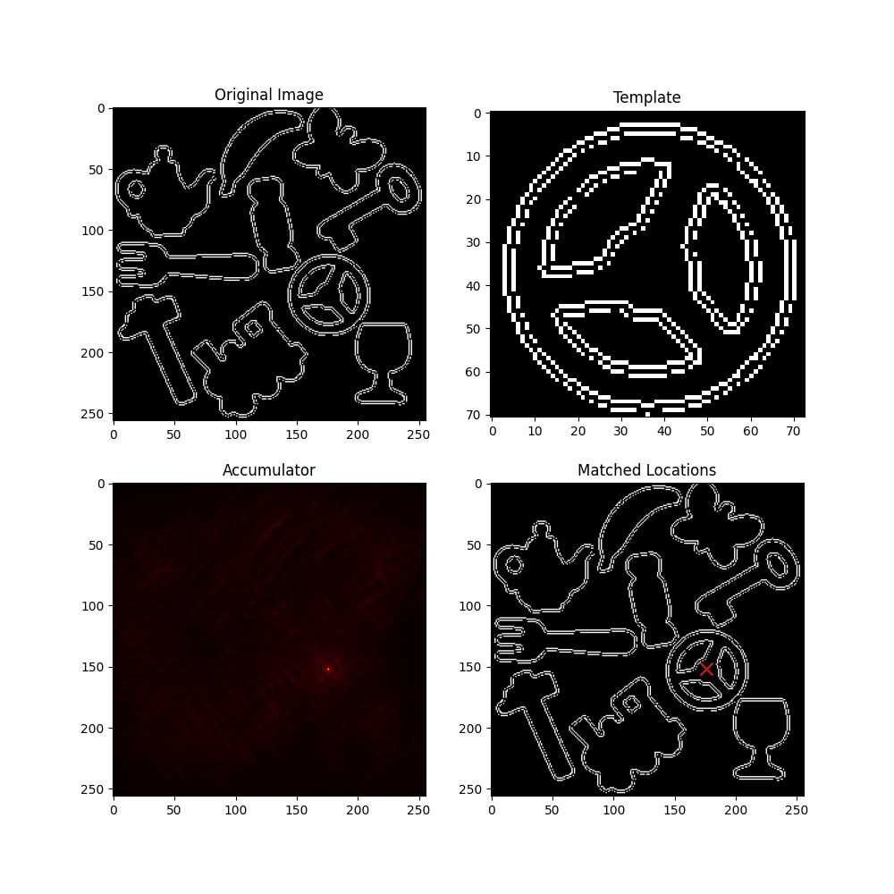

Certainly! Here's the markdown README.md for the Generalized Hough Transform program, using the provided README.md as an example:

```markdown
# Generalized Hough Transform

This program implements the Generalized Hough Transform algorithm to detect instances of a template image in a larger main image. The Generalized Hough Transform is a powerful technique for object detection and pattern matching.

## Dependencies

To run this program successfully, you must have the following packages installed:

1. Python (3.x recommended)
2. OpenCV (cv2)
   ```bash
   pip install opencv-python
   ```
3. NumPy
   ```bash
   pip install numpy
   ```
4. Matplotlib
   ```bash
   pip install matplotlib
   ```

## Key Features

The program consists of several functions that perform the different steps of the Generalized Hough Transform algorithm:

- `buildingReferenceTable`: Builds the reference table for the template image by calculating the (r, alpha) pairs for each edge pixel.
- `calculate_accumulator`: Calculates the accumulator array for the main image using the reference table.
- `find_best_match`: Finds the location with the highest vote in the accumulator, indicating the best match.
- `find_all_matches`: Finds all locations in the accumulator with votes above a specified threshold.
- `convolution_padding`: Performs manual convolution of an image with a kernel, using padding to handle border pixels.
- `sobel_filter`: Applies the Sobel filter to an image to extract horizontal and vertical edges.
- `gradient_intensity`: Calculates the gradient magnitude and direction of the image.
- `plotBestMatches`: Plots the original image, template, accumulator, and matched locations.

## Usage

The program can be run from the command line with the following arguments:

- `mainImageName`: The path to the main image file.
- `referenceImageName`: The path to the reference (template) image file.
- `--threshold_ratio`: The threshold ratio for finding all matches (default: 0.8).

Example usage:

```bash
python generalizeHoughTransform.py main_image.jpg reference_image.jpg --threshold_ratio 0.8
```

## Output

The program generates an output plot (`output.png`) that visualizes the following:

- The original main image
- The template image
- The accumulator array
- The matched locations (green 'x' markers)
- The best matched location (red 'x' marker)

Additionally, the program prints the number of matched locations found based on the specified threshold ratio.

## Example

Here's an example result of running the Generalized Hough Transform program:

```bash
python generalizeHoughTransform.py image.jpg template.jpg --threshold_ratio 0.9
```




For more details on the implementation and theory behind the Generalized Hough Transform algorithm, please refer to the source code and the accompanying documentation.```

This README.md provides an overview of the Generalized Hough Transform program, its dependencies, key features, usage instructions, and expected output. It also includes an example command and a placeholder for the output image. You can replace the placeholder image with an actual example output from your program.